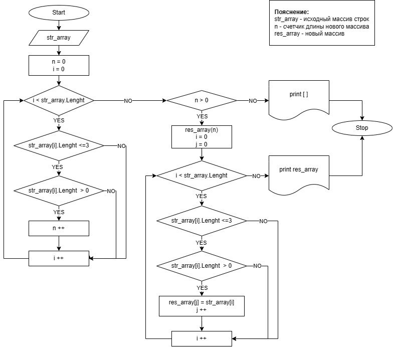

# DZ_itog_c-
##  Контрольная работа
Для выполнения проверочной работы необходимо:
1. Создать репозиторий на GitHub
2. Нарисовать блок-схему алгоритма (можно обойтись блок-схемой основной содержательной части, если вы выделяете её в отдельный метод)
3. Снабдить репозиторий оформленным текстовым описанием решения (файл README.md)
4. Написать программу, решающую поставленную задачу
5. Использовать контроль версий в работе над этим небольшим проектом (не должно быть так, что всё залито одним коммитом, как минимум этапы 2, 3, и 4 должны быть расположены в разных коммитах)

**Задача:** Написать программу, которая из имеющегося массива строк формирует новый массив из строк, длина которых меньше, либо равна 3 символам. Первоначальный массив можно ввести с клавиатуры, либо задать на старте выполнения алгоритма. При решении не рекомендуется пользоваться коллекциями, лучше обойтись исключительно массивами.

**Примеры:**
* [“Hello”, “2”, “world”, “:-)”] → [“2”, “:-)”] 
* [“1234”, “1567”, “-2”, “computer science”] → [“-2”] 
* [“Russia”, “Denmark”, “Kazan”] → []

## Алгоритм решения:
1. вводим длину массива строк и заполняем его строками. Выводим на эран.
2. определяем длину нового массива. Для этого длину каждого элемента исходного массива строк сравниваем с числом 3, если длина меньше или равна 3, то проверяем не пустая ли это строка. Если длина <=3 и >0, то увеличиваем счетчик длины нового массива на 1.
3. если длина нового массива = 0, то выводим в консоли []
4. если длина нового массива > 0, то создаем новый массив строк длиной, определенной в п.2
5. длину каждого элемента исходного массива строк сравниваем с числом 3, если длина меньше или равна 3, то проверяем не пустая ли это строка. Если длина <=3 и >0, то записываем этот элемент в новый массив
6. выводим на экран получившийся массив

## Алгоритм решения показан в блок-схеме

